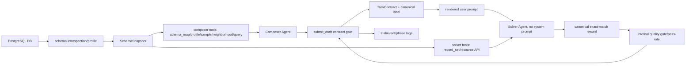

# 역할 분리 / DB 교체형 RLVR 합성 코드베이스 리서치

작성일: 2026-04-26

구현 메모: 이 보고서 작성 직후 1차 privacy slice를 반영했다. `ColumnSpec`
이 visibility를 보존하고, `blocked` non-handle 컬럼은 schema summary,
composer tool surface, solver record-set metadata, 기본 row/sample/profile/query
출력에서 제외된다. PK/FK는 관계 탐색용 handle이라 `blocked`여도 유지한다.
2차 slice에서는 `query` 결과에 `column_sources`와 `referenced_columns`
provenance를 붙이고, `submit_draft`가 그 evidence를 검사하도록 했다.
현재 hard validation은 정밀도 100% 원칙에 맞춰 label이 명시적으로
`internal`/`blocked`인 source 값을 직접 노출하는 경우만 막는다. PK/FK handle
직접 노출, predicate/order 참조의 고객-facing성 판단은 prompt/tool schema의
저작 지침과 diagnostic 영역으로 내리고 hard reject로 쓰지 않는다.

2026-04-26 추가 구현 메모: multi-schema table-name collision도 canonical
table handle 정책으로 보강했다. table name이 snapshot 안에서 유일하고 qualified
alias와 충돌하지 않으면 `customer`처럼 짧은 handle을 유지하고, 충돌하면
`public.customer`, `crm.customer`처럼 `schema.table` handle을 사용한다. Raw table
name에 `.`이 들어간 경우도 qualified alias shadowing을 피하려고 qualified handle을
쓴다. Edge label, tool enum, record_set/schema_map/query provenance도 이 canonical
handle을 쓴다. Composite FK traversal도 `EdgeSpec.source_columns` /
`target_columns` tuple 기반으로 보강했다.

## 관점

이 리서치는 다음 목표를 기준으로 코드베이스 전체를 다시 읽은 결과다.

- 같은 코드로 임의의 read-only PostgreSQL DB를 바꿔 끼우면, 그 DB의 실제 데이터에 grounded 된 고객-agent RLVR 데이터셋이 합성되어야 한다.
- 합성된 문제는 고객-facing이어야 한다. 최종 사용자는 DB, 테이블, 컬럼, PK/FK를 모르는 사람이다.
- 파이프라인의 각 에이전트는 독립된 역할만 수행한다. Composer는 grounded customer-facing task draft를 작성하고, solver/actor/training/pass-rate/RLVR 같은 외부 목적을 알 필요가 없다.
- Solver는 system prompt 없이, composer가 만든 사용자 요청과 도구만으로 문제를 푼다.
- 검증은 휴리스틱으로 답을 맞히는 것이 아니라, 정밀도 100%인 계약 검사와 실제 solver pass/fail 통계로 품질을 판단한다.

## 결론

현 코드베이스는 역할 분리 방향으로 크게 정리되어 있다. Composer prompt는 synthetic dataset/RLVR/actor/solver/pass-rate vocabulary를 피하고 있고, solver backend는 실제로 `instructions=None`으로 생성된다. Composer tool과 solver tool도 의도적으로 비대칭이다. Composer는 authoring/oracle에 가까운 고대역 DB 도구를 쓰고, solver는 여러 API endpoint를 조합해 답에 도달하는 resource API를 쓴다.

하지만 "DB만 갈아끼우면 된다"는 목표에는 아직 빈틈이 있다. Privacy visibility, multi-schema table-name collision, composite FK traversal, DB-level read-only/control lane은 위 구현 메모의 slice들로 핵심 경로를 보강했다. 다음으로 남은 위험은 relation label 안정성, profiler identifier quoting, initial entity를 prompt text가 아니라 resource state로 주는 문제 쪽이다.

냉정한 점수는 다음 정도다.

| 축 | 점수 | 판단 |
| --- | ---: | --- |
| 역할 분리 / 프롬프트 격리 | 8.8 / 10 | 이번 리서치 중 남은 visible leak를 고쳐 9점권에 가까워졌다. |
| Solver 순수성 | 9.5 / 10 | `Agent.instructions=None`이 명시되어 있고 테스트도 있다. |
| Composer/Solver tool 비대칭 | 8.5 / 10 | 설계 방향은 좋다. Composer는 DB 친화, solver는 API endpoint 조합형이다. |
| 고객-facing task 보장 | 7.0 / 10 | prompt/feedback은 좋아졌지만 privacy와 `<entity>` 노출 정책이 아직 약하다. |
| 임의 DB 적응성 | 6.5 / 10 | 단일 schema/단일-column FK/일반 identifier에는 강하지만 넓은 PostgreSQL에는 취약하다. |
| 관측/실험 로그 | 8.0 / 10 | 내부 로그는 풍부하다. 다만 agent-visible feedback과 내부 품질 로그 분리는 계속 지켜야 한다. |

## 구조 지도

핵심 경계는 비교적 잘 잡혀 있다.

- Composer system prompt: `src/rl_task_foundry/synthesis/prompts.py`
- Composer user input: `build_synthesis_input(...)`
- Composer authoring tools: `src/rl_task_foundry/tooling/composer/*`
- Draft gate and internal quality loop: `src/rl_task_foundry/synthesis/submit_draft_tool.py`
- Solver prompt rendering: `src/rl_task_foundry/synthesis/rendered_prompt_builder.py`
- Solver backend: `src/rl_task_foundry/solver/backend_openai_agents.py`
- Solver tool API: `src/rl_task_foundry/tooling/atomic/tool_factory.py`
- Reward: `src/rl_task_foundry/synthesis/canonicalize.py`

## Agent-visible Surface Audit

### Composer

Composer instruction은 현재 "grounded customer-facing task drafts"를 만드는 역할만 말한다. `tests/test_synthesis_prompts.py`는 `synthetic`, `dataset`, `RLVR`, `actor`, `solver`, `pass_rate`, `quality gate`, solver tool names가 instruction에 노출되지 않는다고 검증한다.

Composer user input은 다음을 제공한다.

- Starting Entity: `table`, `pk_column`, `row_id`, `entity`
- Session Context: domain/scenario/topic/language
- Environment: table count, FK edge count, 일부 schema orientation
- Callable data tools
- Schema topology, optional examples pack, optional data distributions

이것은 "DB 친화적인 authoring/oracle" 관점에서는 타당하다. Composer는 고객이 아니라 draft author이므로 schema/tool을 볼 수 있다. 다만 Composer에게도 solver/actor/RLVR/training 목적은 숨겨야 하고, 현재는 그 원칙을 대체로 지킨다.

### Solver

Solver는 `src/rl_task_foundry/solver/backend_openai_agents.py`에서 `Agent(..., instructions=None, ...)`로 만들어진다. 이 부분은 목표와 정확히 맞는다.

Solver가 보는 것은 `build_rendered_user_prompt(...)`가 만든 텍스트다.

- `<entity>` JSON block
- natural user request
- submit result schema

주의할 점은 `<entity>` block이 모델에게 실제로 보인다는 것이다. 즉 "DB가 알려주지 않고 actor가 tool 호출해야 한다"는 원칙을 엄밀히 적용하면, 이 block은 customer text가 아니라 environment-provided initial handle로 취급해야 한다. 앞으로 더 순수하게 만들려면 `<entity>`를 prompt text가 아니라 initial resource handle/tool state로 제공하는 편이 낫다.

## 리서치 중 발견하고 바로 고친 누수

다음 visible leak는 보고서 작성 중 발견했고 수정했다.

- `src/rl_task_foundry/synthesis/turn_budget.py`
  - `composer tools` → `data tools`
  - `too_easy`, `too_hard`, `trial` 같은 내부 상태 표현 제거
- `src/rl_task_foundry/synthesis/submit_draft_tool.py`
  - `Ground-truth answer` → `Canonical answer copied from data-tool evidence`
  - `runtime adds it from entity` → hidden entity block을 직접 넣지 말라는 설명
  - `atomic tool call` → `data-tool call`
- `tests/test_turn_budget_prompt.py`
  - 위 leak가 다시 들어오지 않도록 회귀 테스트 추가
- `tests/test_synthesis_backend_openai_agents.py`
  - feedback wording을 새 surface에 맞춰 갱신

수정 후 targeted 검증은 통과했다.

- `uv run ruff check src/rl_task_foundry/synthesis/turn_budget.py src/rl_task_foundry/synthesis/submit_draft_tool.py tests/test_turn_budget_prompt.py tests/test_synthesis_backend_openai_agents.py`
- `uv run pytest tests/test_turn_budget_prompt.py tests/test_synthesis_backend_openai_agents.py tests/test_synthesis_prompts.py tests/test_synthesis_runtime.py`

## 주요 Findings

### F1. Privacy visibility가 tool surface에 적용되지 않는다

심각도: P0/P1

리서치 당시 `schema/introspect.py`와 `schema/sensitivity.py`는 column visibility를 계산하지만, `tooling/common/schema.py::snapshot_from_graph`가 `ColumnSpec`을 만들 때 visibility를 버리고 있었다. 그 뒤 composer/solver tool은 `schema_map`, `sample`, `profile`, `neighborhood`, `get_record`에서 모든 컬럼과 값을 그대로 노출할 수 있었다.

`docs/spec/atomic-resource-api-v2.md`에는 "visibility/privacy filtering must be applied before the snapshot becomes a tool surface"라고 적혀 있지만, 현재 구현은 그 계약을 지키지 않는다.

영향:

- 임의 고객 DB에서 email/phone/address/token/card-like 값이 composer, solver, trace에 노출될 수 있다.
- prompt가 "내부 식별자를 쓰지 말라"고 해도 도구 응답 자체는 민감값을 보여줄 수 있다.
- 고객-facing dataset이라는 목표와 충돌한다.

1차 반영:

- `ColumnSpec.visibility` 보존 및 snapshot serialization round-trip 추가
- `blocked` non-handle 컬럼을 schema summary, composer schema/sample/profile/neighborhood/query 기본 출력, solver record-set metadata/get_record/filter/sort/aggregate surface에서 제외
- sample DB config의 기본 visibility를 `user_visible`로 조정하고, 이름 기반 sensitive 추론이 우선 적용되도록 sensitivity ordering 정리
- regression tests 추가

2차 반영:

- `query`가 출력 컬럼 provenance와 where/order_by reference visibility를 반환
- `submit_draft`가 latest query의 visibility evidence를 필수로 요구
- label 값이 명시적 `internal`/`blocked` source를 직접 노출하면 reject
- PK/FK handle 직접 노출과 request/query 참조 품질은 hard validation이 아니라
  prompt/tool-schema guidance와 diagnostic으로 다룬다.

남은 권장:

- future actor prompt에서 `<entity>`를 prompt text가 아니라 initial resource handle로 옮기는 설계를 검토한다.

### F2. Multi-schema table-name collision에 취약하다

심각도: P1

상태: 2026-04-26에 수정됨.

이 리서치 당시에는 `SchemaSnapshot.table(table_name)`이 `table.name`만 보고
찾았고, `table_names()`도 unqualified name만 반환했으며, edge label도 schema를
포함하지 않았다.

현재 구현:

- `TableSpec.handle`이 canonical actor/composer-facing table identifier다.
- table name이 snapshot에서 유일하고 qualified alias와 충돌하지 않으면 handle은 bare name이다.
- 같은 table name이 여러 schema에 있으면 handle은 `schema.table`이다.
- raw table name에 `.`이 들어가면 qualified alias shadowing을 피하려고 qualified handle을 쓴다.
- `SchemaSnapshot.table("customer")`는 중복 이름이면 `KeyError`를 낸다.
- edge label과 record_set/schema_map/query provenance는 canonical handle을 쓴다.

영향:

- 수정 전에는 `public.customer`와 `crm.customer`가 같이 있으면 어떤 테이블인지 구분할 수 없었다.
- 현재는 single/composite FK 기준의 tool contract에서는 모호성이 제거됐다.

남은 주의:

- 사람이 읽는 label과 stable opaque id를 분리할지는 더 큰 DB에서 관찰한 뒤 결정한다.

### F3. Composite FK traversal 누락

심각도: P1

상태: 2026-04-26에 수정됨.

이 리서치 당시에는 `tooling/common/schema.py::snapshot_from_graph`가
source/target column이 각각 1개인 FK만 `EdgeSpec`으로 만들었다.

현재 구현:

- `EdgeSpec`는 `source_columns` / `target_columns` tuple을 가진다.
- `snapshot_from_graph`는 source/target column list가 non-empty이고 길이가 같으면 composite FK도 보존한다.
- atomic `follow_relation`/`rows_via` SQL은 모든 column pair를 `AND` join으로 컴파일한다.
- composer `query`와 `neighborhood`도 composite FK join을 지원한다.
- single-column label은 기존 형식을 유지하고, composite label은 `src.(a,b)->dst.(x,y)` / `dst.(x,y)<-src.(a,b)` 형식을 쓴다.

영향:

- 수정 전에는 composite FK 관계 traversal이 불가능했다.
- 현재는 core solver/composer traversal 경로에서는 composite FK 도달성이 회복됐다.

남은 주의:

- 더 큰 DB에서 composite label이 너무 길거나 충돌하면 stable opaque relation id를 분리한다.

### F4. Control/composer DB lane read-only 누락

심각도: P1/P2

상태: 2026-04-26에 수정됨.

이 리서치 당시에는 `infra/db.py::solver_session_settings`만
`SET default_transaction_read_only = on`을 적용했고, `control_session_settings`는
timeout/search_path만 설정하고 readonly SQL이 비어 있었다.

현재 구현:

- `control_session_settings`도 `SET default_transaction_read_only = on`을 적용한다.
- `readonly_role`이 설정되어 있으면 control lane에도 `SET ROLE`을 적용한다.
- schema introspection, profiling, smoke connection은 `_apply_session_settings(..., control_session_settings(...))`를 통해 readonly/role/timeout을 모두 적용한다.
- composer authoring tools는 synthesis runtime에서 solver pool이 아니라 read-only control pool을 사용한다.
- proof fixture DDL은 `mutating_control_session_settings`로 명시적으로 분리했다.

남은 주의:

- 실제 운영에서 migration/admin 계정은 별도 프로세스로 분리하는 편이 더 명확하다.

### F5. Profiler가 identifier quoting 없이 SQL을 만든다

심각도: P2

`schema/profiler.py`는 `f"SELECT avg({col.column_name}::float) ... FROM {qualified}"` 형태로 SQL을 만든다. 프로젝트에는 `quote_ident`, `quote_table` helper가 있는데 이 경로는 쓰지 않는다.

영향:

- reserved word, mixed-case identifier, 특수문자 column/table에서 profiling이 실패한다.
- 임의 PostgreSQL DB 적응성 점수를 깎는다.

권장:

- 모든 profiler SQL에 `quote_ident`/`quote_table`을 적용한다.
- numeric cast 실패 가능성도 column type별로 더 엄격히 처리한다.

### F6. Anchor sampler가 너무 좁다

심각도: P2

`SynthesisDb.random_anchor`는 단일-column PK이고 row estimate가 100 이상인 테이블만 anchor 후보로 삼는다. anchor 반환값에 `table`, `pk_column`, `row_id`, `entity`를 넣는 방향은 좋지만, 후보 선택은 arbitrary DB에 좁다.

영향:

- 작은 DB, composite PK 중심 DB, dimension table 중심 DB에서는 anchor가 없을 수 있다.
- rich한 user-facing entity가 있어도 row estimate 기준 때문에 제외될 수 있다.

권장:

- composite PK anchor를 지원한다.
- row estimate threshold를 config/adaptive로 낮춘다.
- readable surface, inbound/outbound reachability, fanout을 함께 점수화한다.

### F7. `<entity>` block의 의미가 아직 애매하다

심각도: P2

Solver에게 system prompt는 없지만, rendered user prompt에는 `<entity>` JSON이 붙는다. 이 값은 고객 자연어 요청이 아니라 환경 anchor다.

영향:

- "고객은 DB를 모른다"는 목표와 "actor는 시작점을 알아야 한다"는 요구가 prompt 안에서 섞인다.
- 학습 trace 관점에서 actor가 DB id를 자연어의 일부로 배울 위험이 있다.

권장:

- 단기: `<entity>`는 environment handle이라고 spec에 명시하고, user_request 본문과 분리해서 평가한다.
- 중기: initial record/resource handle을 첫 tool state로 주고, rendered user prompt에서는 `<entity>`를 제거한다.

### F8. Atomic API 버전 문서가 drift 되었다

심각도: P2

구현은 현재 `TOOLING_VERSION = "atomic-resource-api-v6"`를 쓴다. v6에서는 scalar/list/pattern/null 필터 분리, related-field filter, source-aligned `list_records` projection을 포함해 실제 solver tool surface가 14개다. 파일명 `atomic-resource-api-v2.md` 같은 역사적 명칭은 남아 있으므로, 이후 문서 rename 또는 version note 정리가 필요하다.

영향:

- 리뷰어와 미래 구현자가 v2/v3 계약을 헷갈릴 수 있다.
- trace schema와 bundle version 판단이 흐려진다.

권장:

- 문서를 v6로 rename 또는 제목/status를 v6로 갱신한다.
- solver-facing tool 14개를 정확히 적는다.
- trace version 예시도 v6로 맞춘다.

### F9. Per-DB examples pack은 선택 기능이어야 한다

심각도: P2

`rl_task_foundry.postgres_air.yaml`의 hand-written examples pack은 trial 품질을 올릴 수 있다. 하지만 목표가 "DB만 갈아끼우면 합성된다"라면, 새 DB마다 사람이 examples pack을 써야 하는 구조가 되면 안 된다.

권장:

- examples pack은 optional expert hint로 둔다.
- core path는 schema/profile/fanout에서 local structural examples를 자동 생성해야 한다.
- 실험 리포트에서 examples pack 사용 여부를 반드시 기록한다.

## Tool 설계 평가

Composer tool은 DB 친화적이어도 괜찮다. Composer는 고객이 아니라 authoring/oracle 역할이기 때문이다. 현재 5개 tool 구성은 적절하다.

- `schema_map`: 전체/부분 schema orientation
- `profile`: 분포와 filter 후보 탐색
- `sample`: readable surface 확인
- `neighborhood`: anchor 주변 관계 확인
- `query`: canonical label 생성

Solver tool은 일반 API endpoint처럼 보이도록 많이 좋아졌다. `create_record_set`, `filter_record_set`, `follow_relation`, `sort_record_set`, `count_records`, `aggregate_records`, `get_record` 같은 이름은 DB 내부 primitive라기보다 resource API에 가깝다.

남은 쟁점은 `record_set`, `record_ref`, `table`, `primary_key`, `columns` 같은 vocabulary다. 이것은 완전한 고객-facing 언어는 아니지만, solver가 문제를 풀기 위해 호출하는 API endpoint vocabulary로는 허용 가능하다. 더 자연어화하면 오히려 임의 DB 도달성/정확성이 떨어질 수 있다.

## Trial 전 판단

pagila/postgres_air smoke 또는 minimax/opencode trial만 보면, 지금 상태로 다시 돌릴 수 있다. 이번 리서치 중 발견한 visible prompt/feedback leak는 고쳤고 targeted tests도 통과했다.

다만 "임의 DB를 여러 개 돌릴 것"이라는 목표까지 포함하면, trial 전에 최소한 다음은 하는 편이 맞다.

1. Full pytest를 다시 통과시킨다.
2. atomic-resource-api v2/v3 문서 drift를 정리한다.
3. 새 canonical table handle 정책이 실제 multi-schema DB trial에서 충분한지 확인한다.

다양한 실제 고객 DB로 넓히기 전에는 다음이 필요하다.

1. multi-schema/composite-FK DB trial
2. stable relation id 검토
3. profiler identifier quoting
4. control/admin operational split
5. anchor sampler 확장

## 다음 구현 우선순위

가장 높은 ROI였던 privacy visibility enforcement, qualified table handle,
composite FK traversal, DB-level read-only/control lane은 반영됐다. 다음 고위험
일반화 이슈는 실제 고객형 multi-schema/composite-FK trial과 profiler identifier
quoting이다.

추천 순서:

1. Full pytest와 multi-schema focused test를 계속 통과시킨다.
2. atomic API v3 spec 정리와 tool list/trace version 문서 갱신.
3. profiler quoting 적용.
4. multi-schema/composite-FK DB trial을 하나 추가해 실제 schema drift를 관찰한다.
5. relation label이 길거나 충돌하는지 보고 stable relation id 분리를 결정한다.
6. `<entity>`를 prompt text가 아니라 initial tool/resource state로 옮기는 설계 검토.

이 순서가 과하지 않으면서도 9점 이상으로 가는 현실적인 경로다. Prompt를 더 똑똑하게 만드는 쪽보다, tool surface와 contract를 정직하게 만드는 쪽이 RL trace 품질에 더 중요하다.
