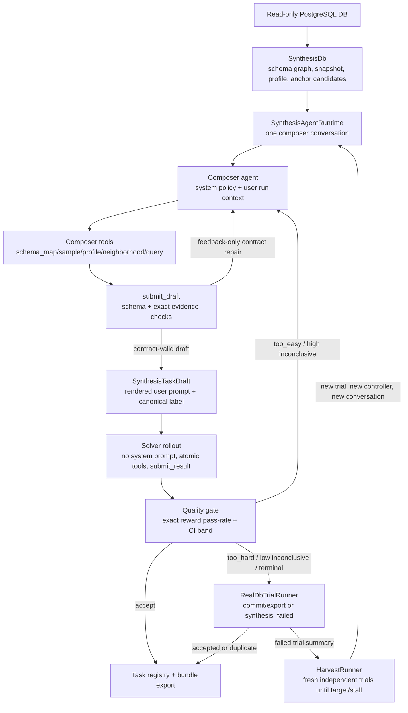
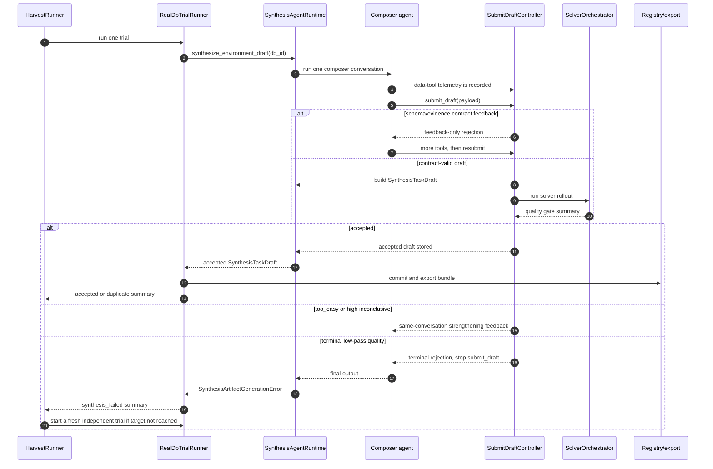
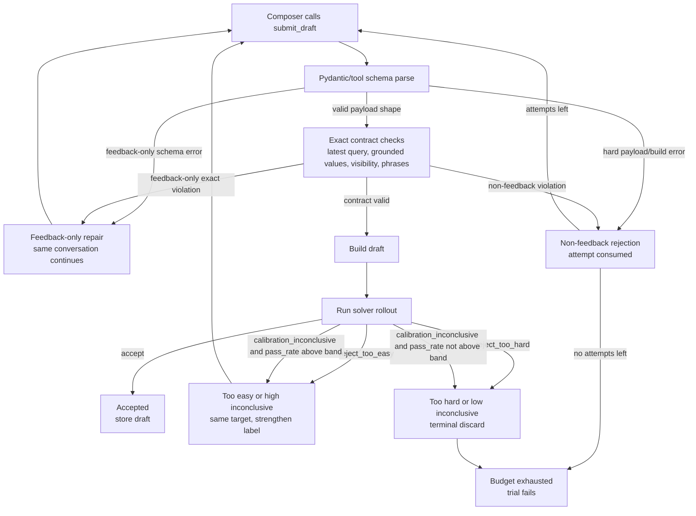
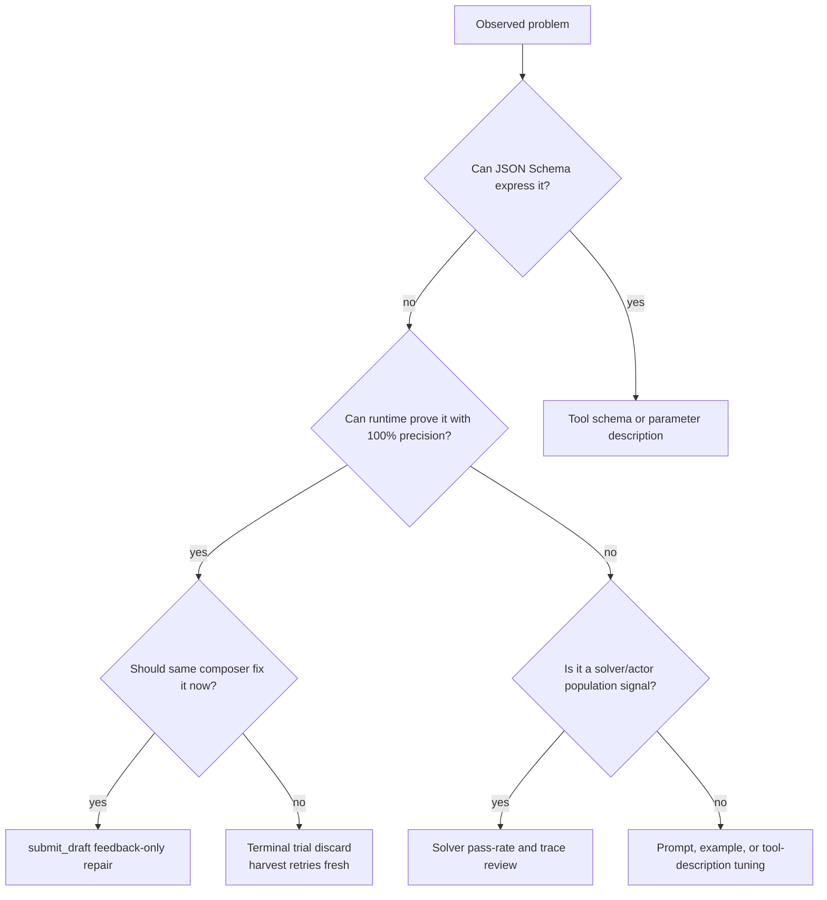

# Pipeline Lifecycle And State Boundaries

This document is the operational map for the end-to-end synthesis pipeline.
Read it before changing synthesis feedback, submit validation, solver rollout,
trial retry, harvest behavior, or registry acceptance.

The key invariant is simple: generation is disposable; accepted task bundles are
the only durable product. A composer conversation may be repaired only for
contract-level feedback. If solver rollout says a draft is not in the desired
pass-rate band, that trial is discarded unless the gate says the draft is too
easy and explicitly asks the same composer to make the same answer harder.

## Mental Model

## Trial Sequence

This sequence is the concrete runtime path. The important boundary is that
`SynthesisAgentRuntime` does not start a second composer conversation after a
terminal draft failure. It raises a failed trial result upward; `HarvestRunner`
is the layer that starts a new trial.

## Code Ownership Map

- `src/rl_task_foundry/synthesis/synthesis_db.py`
  Owns per-DB cached context: schema graph, schema snapshot, data profile, DB
  pools, and optional random anchor candidates.
- `src/rl_task_foundry/synthesis/runtime.py`
  Owns one synthesis conversation at a time, builds composer tools, builds
  `SynthesisTaskDraft`, maps submit records to generation outcomes, and raises
  `SynthesisArtifactGenerationError` when no draft is accepted.
- `src/rl_task_foundry/synthesis/backend_openai_agents.py`
  Runs the composer agent. It finalizes only on `Accepted`, budget exhaustion,
  or controller terminal rejection.
- `src/rl_task_foundry/synthesis/submit_draft_tool.py`
  Owns `submit_draft` schema, exact evidence validation, retry feedback, and
  the bridge from contract-valid drafts into solver rollout.
- `src/rl_task_foundry/pipeline/solver_orchestrator.py`
  Owns solver runs, infra-failure exclusion, top-up attempts, exact reward
  counting, early stop, and pass-rate quality-gate classification.
- `src/rl_task_foundry/solver/backend_openai_agents.py`
  Runs the actor/solver with no system prompt, the generated atomic tools, and a
  task-specific strict `submit_result` schema.
- `src/rl_task_foundry/synthesis/real_db_trial.py`
  Owns one single-shot trial: create debug roots, run synthesis, commit/export
  accepted drafts, or return `synthesis_failed`.
- `src/rl_task_foundry/synthesis/harvest.py`
  Owns repeated independent trials until the target committed count is reached
  or the run stalls.

## Stage 1: Per-DB Context

`SynthesisDb` is long-lived per `db_id` and may be reused across many trials.
It is not the composer conversation.

It provides:

- introspected `SchemaGraph`
- materialized `SchemaSnapshot` for composer/solver tools and bundle export
- `DataProfile`
- optional random anchor candidate pool
- read-only DB connections through shared pools

Anchor candidates are environment randomization, not answer hints. They exist
to prevent stateless composer runs from repeatedly starting at the first or
smallest id. Composer may ignore them. Final label evidence still must come from
live tools and the latest canonical `query`.

## Stage 2: One Composer Conversation

`SynthesisAgentRuntime.synthesize_environment_draft()` creates exactly one
`SubmitDraftController` and one composer conversation for a trial. It gathers
the current DB context, builds the composer tools, instruments tool calls into
the controller, and calls the synthesis backend once.

Prompt layering:

- Composer system instructions are durable role-local policy.
- Composer user input is current-run context: language, domain/scenario,
  schema/profile/affordance map, optional anchor candidates, and local
  examples.
- Composer should not be told actor, solver, pass-rate, training, registry, or
  dataset internals.

Composer surface ownership principle:

- Stable composer behavior policy belongs in the composer system instructions
  first. This includes task-shape rules, label rules, retry strategy, role
  isolation, and calibration behavior such as what to do after a specificity
  rejection.
- Durable policy must have one textual source of truth. Do not duplicate the
  same behavior rule across prompts, tool descriptions, and feedback. If another
  surface needs to invoke that rule, reference the named policy rather than
  restating it.
- Composer user input is for the current run only. Use it for DB/context facts,
  requested language/topic, orientation data, candidates, and local examples;
  do not use it as the main home for durable behavior policy. Render this
  context in one tagged envelope with stable nested tags so each block has an
  explicit boundary, using the Codex user-context style: an
  `<environment_context>` root containing `<session_context>`,
  `<database_context>`, and optional candidate/context blocks.
- Do not mirror the SDK-injected callable tool surface in system instructions
  or user input. Tool names, descriptions, and JSON schemas are sent through the
  SDK/API tool channel; prompt text may reference a tool by name only when a
  workflow step needs that tool.
- Tool schemas and descriptions own tool-local contracts: valid argument shape,
  parameter semantics, result interpretation, and misuse that can be prevented
  at the API boundary. They should not carry broad composer strategy unless the
  strategy is specific to that tool.
- `submit_draft` validation feedback is reactive enforcement. It should report
  exact contract failures or remind the composer to apply an existing policy in
  the current failure state. It must not become the primary home for a new
  general policy. If feedback text starts carrying reusable behavior guidance,
  promote that policy to the system instructions and keep feedback as a short
  pointer to the named policy.
- Hard validation remains limited to 100%-precision contracts. Do not turn
  semantic guesses, naturalness judgments, or inferred difficulty strategy into
  runtime rejection rules.

Composer tool calls are mirrored into `SubmitDraftController` by
`build_instrumented_composer_tools`. This telemetry is the evidence source for
grounding checks, latest-query checks, and trace logging.

## Stage 3: submit_draft State Machine

`submit_draft` has two different jobs:

1. Repair exact contract mistakes inside the same composer conversation.
2. When the draft is contract-valid, run solver rollout and classify quality.

Feedback-only validation keeps the same composer conversation alive. Examples:

- missing new grounded observation
- invalid or missing `entity`
- blank or ungrounded label strings
- answer-contract phrase absent from the user request
- no latest successful `query`
- label not exactly equal to the latest query result
- label directly exposing fields explicitly marked `internal` or `blocked`
- after too-easy feedback, no reward-visible label change

`answer_contract` intentionally does not ask the composer to restate tables,
columns, operators, or SQL clauses. It carries only answer shape and exact
request phrases. Runtime derives query structure from the latest successful
`query` result when it needs structural retry evidence.

These are feedback-only because the same composer can make another tool call,
repair the contract, and resubmit within the same authoring episode.

Non-feedback rejection consumes a submission attempt. If the submit budget is
exhausted, the composer backend finalizes and the trial fails.

Solver-backed quality outcomes have special state semantics:

| Quality outcome | Same composer continues? | Meaning |
| --- | --- | --- |
| `accept` | No | Draft is stored on the controller and becomes a task bundle. |
| `reject_too_easy` | Yes | Same answer target must be strengthened; composer gets feedback. |
| `calibration_inconclusive` with point estimate above band | Yes | Treated as "still too direct"; same target should be strengthened. |
| `reject_too_hard` | No | Terminal discard. The current conversation is over. |
| `calibration_inconclusive` with point estimate not above band | No | Terminal discard as not clearly reachable enough. |

The name `reject_too_hard` is a quality-gate bucket, not a proof of the cause.
It can mean overconstrained, actor-unreachable, tool-trace-unfriendly,
ambiguous/non-unique for exact match, or otherwise low-quality. That is
acceptable: all of those are reasons to discard the trial.

Real trial analysis must go one step further than the gate label. For every
too-hard or low-pass run, record an explicit human adjudication: is the
canonical data and label sound, and did solvers fail because the task is
genuinely difficult for the current tool surface, or because the draft is
ambiguous, under-specified, hidden, non-unique, inconsistent, or otherwise
low-quality? This judgment must be based on structured query evidence, sampled
rows, solver tool traces, and error classes. Do not use DB-value literal
occurrence or token containment in generated prose as evidence.

The terminal-discard policy is intentional. Earlier designs allowed the
composer to weaken a too-hard draft in the same conversation, but in practice
the composer often failed to simplify cleanly. It tended to spend extra turns in
back-and-forth repair, drift away from the original grounded label, or produce a
different low-quality candidate. Starting a fresh trial is usually cheaper and
cleaner than asking the same context to unwind a failed hard draft.

This is asymmetric with too-easy. Making a too-easy draft more specific can be
done by preserving the same answer kind and target while adding one grounded
constraint. Making a too-hard draft easier often requires changing the task
shape, anchor, path, or label semantics, so it is treated as a disposable trial
rather than a repairable draft.

### submit_draft State Diagram

This is the diagram to check before adding a validator or feedback branch.

## Stage 4: Draft Materialization

When `submit_draft` has a contract-valid payload, runtime builds a
`SynthesisTaskDraft`:

- `TaskContract.question` is the customer-facing request body.
- `instance_parameters` are the hidden `entity` handle.
- `canonical_answer_json` is the exact label JSON.
- `output_schema` is inferred directly from the canonical label.
- list labels infer ordered list schemas with exact length.
- `rendered_user_prompt` prepends the hidden `<entity>` block to the request.

The label is the actor-visible `submit_result` object, not final customer prose.
The final natural-language answer is downstream of the verifier boundary.

## Stage 5: Solver Rollout

The solver/actor receives:

- no system prompt
- the rendered user prompt with hidden entity block
- generated atomic DB tools
- a task-specific strict `submit_result` tool

The solver must use tools and terminate by calling `submit_result`. The
`submit_result` schema is inferred from the canonical label and carries exact
copy-value descriptions. Missing or invalid submit calls are actor/runtime
outcomes and count as failures unless they are clearly infrastructural.

`SolverOrchestrator` runs batches until it reaches the target number of
evaluable solver runs or an exact early-stop decision. Current development
configuration is:

- pass-rate band `[0.5, 0.9]`
- `max_solver_runs = 20`
- `solver_batch_size = 4`
- `ci_alpha = 0.1`

Infrastructure failures are excluded only when they are clearly provider/runtime
infrastructure failures, such as rate limits, timeouts, API connection errors,
auth errors, and similar transport/service failures. The orchestrator schedules
replacement attempts up to a finite budget.

These count in the denominator:

- wrong exact answer
- schema mismatch
- invalid submit
- missing submit
- max-turn termination
- unknown SDK `UserError`
- model/tool protocol failures that returned a solver result

Failed trial summaries should still expose the already-computed aggregate
rollout counters from the final attempted draft: pass rate, CI bounds,
matched/planned/completed/evaluable/infra-failed solver counts, feedback-event
count, and last feedback error codes. This is observability only. It must not
trigger additional LLM judging, trace parsing, or retry work for a draft that
will be discarded.

If the orchestrator cannot reach the target evaluable denominator because too
many calls are excluded infrastructure failures, the summary must make that
visible through `solver_completed_runs`, `solver_evaluable_runs`, and
`solver_failed_runs`. That is an environment/provider health signal, not a
solver ability signal.

## Stage 6: Quality Gate

Reward is binary exact match after schema canonicalization. The quality gate
uses exact Clopper-Pearson binomial bounds for early-stop decisions and stores
the two-sided interval as quality metadata.

The gate is intentionally allowed to reject both difficult and low-quality
drafts. Solver pass-rate is the statistical detector for gray-zone failures that
hard validation should not guess: poor naturalness, under-specified ordering,
multi-answer requests, awkward trace surfaces, or tasks that actors do not
reliably solve with the given tools.

The configured band is retargetable. Changing `[lower_pass_rate,
upper_pass_rate]` changes the acceptance policy, not the underlying trace
evidence. Trial reviews should therefore report both the numeric gate result and
the trace-based quality judgment.

Do not replace that statistical role with heuristic validators. Hard validation
is only for 100%-precision contract violations, and even then the state
transition must be correct.

## Stage 7: Trial Boundary

`RealDbTrialRunner` is a single-shot trial wrapper.

On accepted draft:

1. commit the draft to the task registry
2. classify duplicate vs committed
3. export the bundle
4. return an accepted or duplicate trial summary

On `SynthesisArtifactGenerationError`, provider failure, provider unavailable,
or runtime failure:

1. log phase-monitor diagnostics
2. return `RealDbTrialStatus.SYNTHESIS_FAILED`
3. do not continue the same composer conversation

A failed `run-real-db-trial` command is therefore one failed trial, not an
internal retry loop.

## Stage 8: Harvest Boundary

`HarvestRunner` is the retry loop that turns disposable generation into a
target number of accepted bundles.

It runs many independent single-shot trials, optionally in parallel, until:

- `target_committed` accepted tasks are committed, or
- no new commit lands before `stall_timeout_seconds`.

Each trial gets a fresh `RealDbTrialRunner`, fresh `SubmitDraftController`, and
fresh composer conversation. Shared DB pools, solver orchestrator, registry,
exporter, and `SynthesisDb` may be reused for efficiency, but conversation state
does not cross trial boundaries.

Failures such as `too_hard`, validation exhaustion, provider errors, or
duplicates are discarded attempts. Harvest simply starts another trial.

## Failure Routing Diagram

Use this smaller decision chart when deciding where a new failure signal should
live.

## Change Checklist

Before changing validation, feedback, prompts, tool descriptions, solver
rollout, or harvest behavior, answer these questions in the PR or tuning log:

1. Which state owns this problem: schema, tool description, prompt, feedback,
   terminal trial discard, solver statistics, registry, or offline review?
2. If this rule fires, should the same composer conversation continue?
3. If not, do not implement it as feedback-only `submit_draft` repair.
4. Can the runtime prove the violation with 100% precision from schema,
   explicit config, latest query evidence, or exact reward-visible values?
5. If precision is below 100%, leave it to prompts/tool schemas/examples,
   qualitative trace review, or solver pass-rate.
6. Does the rule rely on table-name, column-name, tool-name, or generated-text
   tokens? If yes, it violates the no-semantic-token-heuristics rule.
   Does it rely on DB literal occurrence or absence in generated text or label
   text? If yes, it is also forbidden as validator evidence.
   This remains forbidden when the literal was discovered dynamically from the
   current DB or latest query; dynamic observation does not make containment
   against natural language precise.
7. Could this rule hide a valid task shape in an arbitrary good DB? If yes, it
   must not be a hard validator.
8. Does the change leak composer, solver, actor, pass-rate, training, or
   registry internals across role boundaries?

## Practical Decision Table

| Situation | Correct layer |
| --- | --- |
| Tool argument shape is wrong | JSON schema / strict schema / concise field description |
| Label is not copied from latest query | `submit_draft` feedback-only validation |
| Label exposes explicit `internal` or `blocked` source field | `submit_draft` feedback-only validation |
| Composer produced a too-easy draft | Same conversation feedback; preserve answer kind/target and strengthen |
| Actor pass-rate is too low | Terminal trial discard; harvest starts fresh |
| Actor pass-rate is too high | Same conversation feedback only when gate classifies too-easy/high inconclusive |
| Task may be ambiguous, awkward, or low-quality but not exactly provable | Solver pass-rate, trace review, prompt/schema tuning |
| Too-hard draft may actually be sound but difficult | Human trace adjudication; consider band/model/tool-surface changes before calling it bad data |
| Provider rate limit or transport failure | Exclude as infra and top up, within attempt budget |
| Unknown model/tool protocol failure | Count as evaluable failure unless explicitly classified as infra |
| Duplicate accepted task | Registry duplicate; not a composer retry |

## Anti-Patterns

- Adding a feedback validator just because a condition is detectable, without
  checking whether that condition should terminate the trial.
- Treating `reject_too_hard` as only "too difficult". It also carries other
  low-pass quality failures.
- Treating `reject_too_hard` as proof of bad data without inspecting query
  evidence, label correctness, and solver traces.
- Letting hard validation steal the statistical job of solver rollout.
- Repairing terminal low-quality drafts inside the same composer conversation.
- Adding semantic token heuristics to "help" DB adaptation.
- Adding DB-value literal containment checks as validation evidence.
- Treating a dynamically observed DB literal as safe merely because it was not
  hard-coded.
- Moving current-run DB facts into composer system instructions.
- Giving the solver a system prompt or composer/quality-gate internals.
